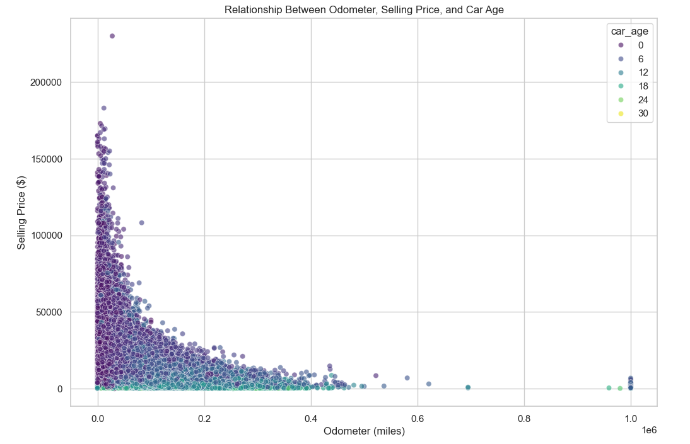
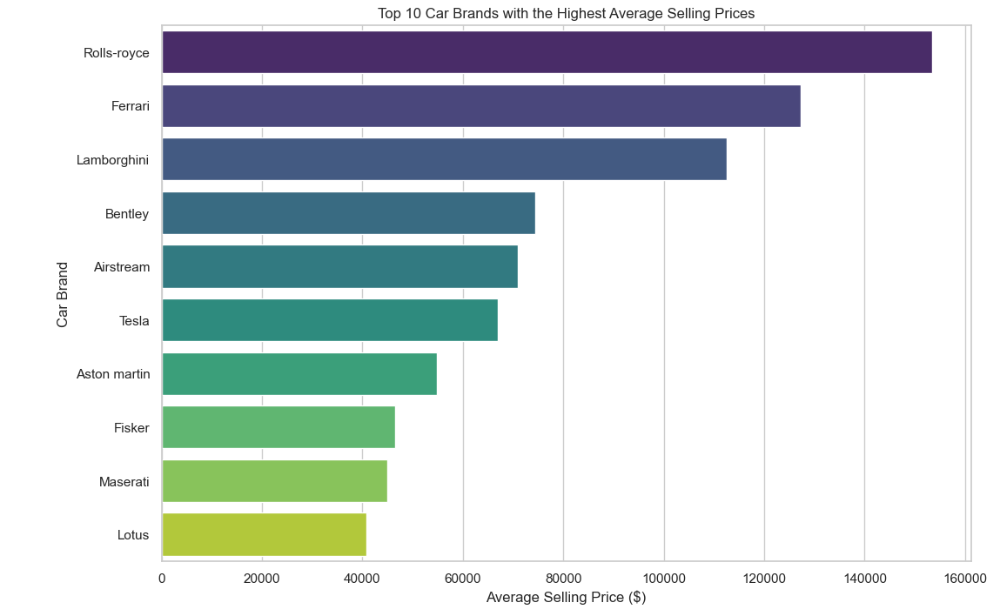
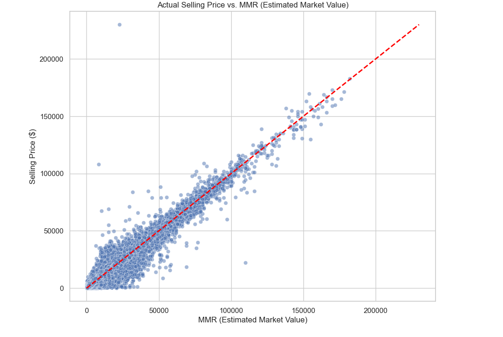
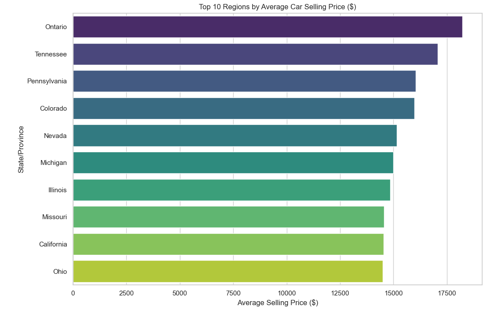
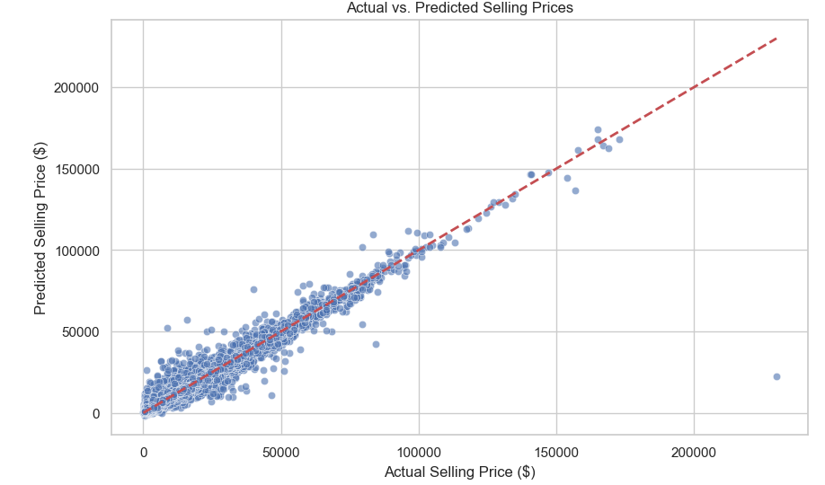

# Used Car Market Analysis

## Project Overview
This project analyzes the used car market to understand the key factors affecting car selling prices. Using a Kaggle dataset with over 558,000 rows and 16 columns, the project covers data cleaning, exploratory data analysis (EDA), and a simple machine learning model to predict car prices.

## Key Features of the Analysis
- **Car Age & Mileage:** Explore how a car’s age and mileage affect its selling price.
- **Top Brands:** Identify which brands have the highest average selling prices.
- **Market Value vs Actual Selling Price:** Compare the estimated market value (MMR) with the actual selling price.
- **Regional Differences:** Examine how car values vary across different states.
- **Machine Learning Model:** Predict car prices using features like year, mileage, MMR, and car age.

## Visualizations

### Car Age vs Mileage Impact
This scatter plot shows how a car’s age and mileage influence its selling price. Newer cars with lower mileage tend to sell for higher prices, while older cars with higher mileage sell for less.  

### Top 10 Brands by Average Selling Price
The bar chart shows the average selling prices for the top 10 car brands. Luxury brands like Rolls-Royce, Ferrari, and Lamborghini have the highest prices, while economy brands like Maserati and Lotus sell lower.  

### Market Value (MMR) vs Actual Selling Price
This chart compares the estimated market value (MMR) with the actual selling price. Cars above the red line sold for more than expected, while cars below the line sold for less.  

### Regional Differences in Car Values
The bar chart shows the average selling price by state. States like Ontario, Tennessee, and Pennsylvania have the highest prices, likely due to high demand and a larger luxury car market.  

### ML Model: Actual vs Predicted Selling Price
This scatter plot shows how well the Linear Regression model predicts car prices.  
- Points close to the red dashed line indicate accurate predictions.  
- Points above the line are underestimated, and points below are overestimated.  

## Machine Learning Model
A **Linear Regression model** is trained at the end of the analysis to predict selling prices.
- **Features Used:** Year, Mileage, MMR, Car Age
- **Data Split:** 80% Training / 20% Testing
- **Evaluation Metrics:** Mean Squared Error (MSE) and R² score (closer to 1 means better prediction)

The ML model is integrated within the main Python file (`used_car_analysis.py`) after the EDA and visualizations, allowing full analysis and prediction in one place.

## Key Insights
1. **Age and mileage lower a car’s value.**
2. **Luxury brands sell for more** than economy brands.
3. **Accurate pricing boosts profit.**
4. **Car values vary by region**, with higher prices in states like California and Florida.
5. **ML model predicts prices fairly well**, supporting smarter pricing strategies.

